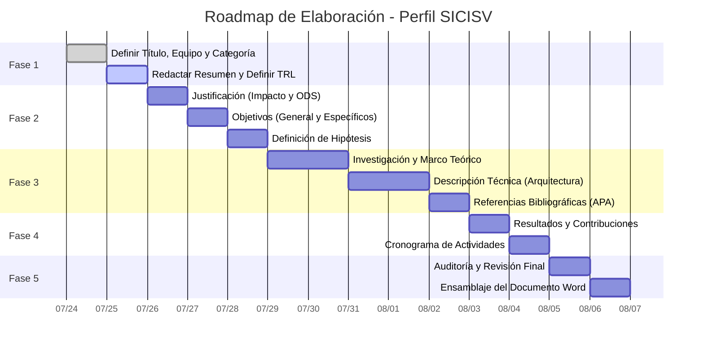

# Plan de Desarrollo y Roadmap: Perfil del Proyecto SICISV 

Este documento establece la estrategia, metodología de trabajo y la hoja de ruta (Roadmap) para la elaboración profesional del **Perfil del Proyecto de Innovación Tecnológica** basado en el **Sistema de Control de Ingresos y Salidas de Vehículos (SICISV)**. 

El objetivo es cumplir al 100% con los estándares de calidad y la estructura exigida en las Bases Oficiales del concurso **INNOVA SUIZA 2026** (Capítulo IX).

---

## 1. Estrategia de Desarrollo (Metodología "Parte por Parte")

Para garantizar una redacción excelente, coherencia argumentativa y el uso de referencias 100% reales en formato APA, dividiremos la elaboración del documento en **5 Fases de Trabajo (Sprints)**. En cada fase, nos enfocaremos en un bloque específico de la estructura oficial. Al finalizar cada bloque, este será revisado antes de continuar con el siguiente.

### Fase 1: Identidad y Contextualización (Ítems 1 al 3)
* **Objetivo:** Definir la carta de presentación del proyecto.
* **Componentes a desarrollar:**
  * **Ítem 1. Título del Proyecto:** Adaptar el nombre a un título académico/innovador (Max 20 palabras).
  * **Ítem 2. Datos Generales:** Definir el equipo de la carrera "Desarrollo de Sistemas de Información" (DSI). Seleccionar la categoría ideal (sugiero **Categoría A: Procesos de Desarrollo Empresarial** o **C: Procesos y Servicios Industriales**).
  * **Ítem 3. Resumen de la Propuesta:** Redactar un *abstract* de alto impacto y definir el nivel TRL (Technology Readiness Level). Como SICISV ya está funcional, lo ubicaremos en **TRL 7** (Prototipo validado en entorno real) o **TRL 8**.

### Fase 2: Fundamentación e Intención (Ítems 4, 5 y 7)
* **Objetivo:** Demostrar por qué el proyecto es necesario, qué busca lograr y qué premisa valida.
* **Componentes a desarrollar:**
  * **Ítem 4. Justificación:** Enlazar la seguridad patrimonial, la transformación digital y la optimización de tiempos con Objetivos de Desarrollo Sostenible (ODS), como el ODS 9 (Innovación e Infraestructura) y el ODS 16 (Instituciones Sólidas).
  * **Ítem 5. Objetivos:** Definir 1 objetivo general y 3-4 específicos (medibles), enfocados en el despliegue del stack técnico (React 19, IA Facial, PostgreSQL).
  * **Ítem 7. Hipótesis:** Establecer la relación lógica entre el uso de reconocimiento facial biométrico (IA) y la reducción de vulnerabilidades de seguridad en controles vehiculares.

### Fase 3: Rigor Científico y Tecnológico (Ítems 6, 10 y 11)
* **Objetivo:** Sustentar el proyecto con literatura científica y describir el desarrollo ingenieril avanzado.
* **Componentes a desarrollar:**
  * **Ítem 6. Marco Teórico y Referencial:** Investigaremos fuentes académicas 100% reales (papers, libros) sobre: Reconocimiento Facial (InsightFace), arquitecturas PWA Offline-First, y Bases de datos vectoriales (`pgvector`).
  * **Ítem 10. Descripción Técnica y Metodológica:** Explicar los protocolos del desarrollo de software (Scrum/Agile), la arquitectura de microservicios, el flujo secuencial de captura fotográfica y la tecnología subyacente. Se definirá el rol de cada integrante (Desarrollador Backend, Frontend, Especialista IA, etc.).
  * **Ítem 11. Referencias Bibliográficas:** Compilación de la bibliografía real utilizada en formato APA (7ma edición).

### Fase 4: Planificación, Resultados e Impacto (Ítems 8 y 9)
* **Objetivo:** Demostrar la viabilidad organizativa y el impacto regional del software.
* **Componentes a desarrollar:**
  * **Ítem 8. Cronograma de Actividades:** Creación de un Diagrama de Gantt lógico que abarque desde el levantamiento de requerimientos hasta el despliegue final y pruebas de la IA.
  * **Ítem 9. Resultados y Contribuciones:** Detallar el valor heurístico (arquitectura de IA en el borde) y las implicaciones prácticas (automatización de garitas de control y exportación de reportes).

### Fase 5: Revisión de Cumplimiento y Formateo
* **Objetivo:** Auditoría final del documento.
* **Acciones:**
  * Validar que el total no exceda las **10 páginas**.
  * Corrección de estilo, ortografía y redacción académica.
  * Ajuste de tablas y justificación de párrafos.

---

## 2. Roadmap de Ejecución 

Este roadmap ilustra el flujo de trabajo que seguiremos nosotros (IA y Usuario) en nuestras próximas interacciones para generar el documento final.

